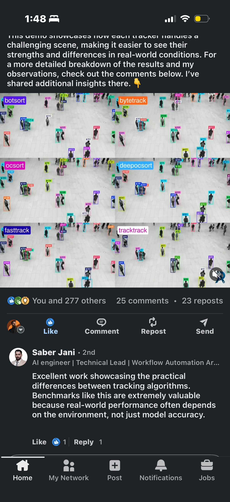

# Real-Time Multi-Object Tracking on NVIDIA B300 (DeepStream 9.0)

Real-time multi-object tracking benchmarked on an **8× NVIDIA B300 SXM6** node,
plus a **6-tracker side-by-side comparison grid**: the same crowded pedestrian
scene processed by several trackers at once, rendered as a 2×3 mosaic.

### → Live results dashboard: **[view the B300 showcase](https://nmadhub.github.io/b300-realtime-tracking/)**

Measured highlights (single node, DeepStream 9.0, FP16):

| Metric | Value |
|---|---|
| Aggregate BF16 compute (8× B300) | **12.35 PFLOPS** |
| People-detection throughput (1 B300) | **2,043 fps** |
| Real-time 1080p@30 streams (node) | **544** |
| HBM per GPU | 287 GB |

Reproduce with `python3 scripts/b300_showcase.py` inside the container; the
dashboard in `docs/` reads the resulting `output/b300_results.json`.



## Why this design

In a fair tracker benchmark you must **detect once and share the detections**
across every tracker. Otherwise you end up comparing detectors, not trackers.
So the pipeline is:

```
                                  ┌─> ByteTrack ─┐
  video ─> [DeepStream]           ├─> BoTSORT  ──┤
           GPU decode + YOLO ──>  ├─> OCSORT   ──┤──> draw + 2×3 grid ──> mp4
           (nvinfer, pyds probe)  ├─> DeepOCSORT┤        + timing stats
            detections (once)     ├─> FastTrack ┤
                                  └─> TrackTrack┘
```

DeepStream (`nvstreammux → nvinfer → nvvideoconvert → appsink`) does the heavy
GPU work; a `pyds` pad probe pulls out detections + frames; the trackers run in
Python and are swappable via a small adapter interface.

## Tracker coverage

| Tracker | Source | Status |
|---|---|---|
| ByteTrack | `boxmot` | ✅ built-in |
| BoTSORT | `boxmot` | ✅ built-in (ReID) |
| OCSORT | `boxmot` | ✅ built-in |
| DeepOCSORT | `boxmot` | ✅ built-in (ReID) |
| FastTrack | external repo | 🔌 adapter stub — wire in `src/trackers/external_adapter.py` |
| TrackTrack | external repo | 🔌 adapter stub — wire in `src/trackers/external_adapter.py` |

`boxmot` also gives you StrongSORT and BoostTrack for free if you want to swap
those into the grid.

## Quick start

### Option A — DeepStream container (intended path)

You said you can pull NGC images. This is the full GPU pipeline.

```bash
cd mot-tracker-benchmark
./run.sh build                      # builds on the DeepStream NGC base image
# put a video at assets/crowd.mp4 and a YOLO ONNX at models/ (see configs/)
./run.sh run                        # runs the 6-up benchmark -> output/comparison.mp4
```

Before the DeepStream backend works you need a YOLO engine for `nvinfer`. See
`configs/pgie_yolo_config.txt` — it documents the
[DeepStream-Yolo](https://github.com/marcoslucianops/DeepStream-Yolo) steps to
export ONNX + build the custom bbox parser.

### Option B — fallback detector (validate logic anywhere with a GPU)

No DeepStream needed; uses ultralytics YOLO for detection so you can confirm the
tracking + grid logic before wiring up nvinfer.

```bash
pip install -r requirements.txt
python -m src.benchmark \
  --video assets/crowd.mp4 \
  --backend ultralytics \
  --trackers bytetrack botsort ocsort deepocsort strongsort boosttrack \
  --output output/comparison.mp4
```

## Output

- `output/comparison.mp4` — the 2×3 grid video
- console table — avg ms/frame, fps, and unique-ID count per tracker

For rigorous accuracy (MOTA / IDF1 / HOTA) you need ground-truth labels; run
[TrackEval](https://github.com/JonathonLuiten/TrackEval) on the per-tracker
results (hook noted in `src/benchmark.py`).

## Integrating into NVIDIA VSS

VSS uses DeepStream as its CV ingestion/tracking layer. The same `nvinfer` +
tracker setup here maps onto the VSS CV pipeline config — the tracker provides
the stable object IDs VSS uses for spatio-temporal grounding before VLM
summarization. Start from the `deepstream` backend, then port the chosen
tracker's low-level config into the VSS blueprint's CV pipeline.

## Layout

```
src/
  benchmark.py            # orchestrator + CLI
  detector.py             # DeepStreamDetector (pyds) + UltralyticsDetector
  visualize.py            # box/ID drawing, 2×3 grid, video writer
  trackers/
    base.py               # Track + TrackerAdapter interface
    boxmot_adapter.py     # ByteTrack/BoTSORT/OCSORT/DeepOCSORT/...
    external_adapter.py   # FastTrack / TrackTrack adapter stubs
configs/pgie_yolo_config.txt
Dockerfile  run.sh  requirements.txt
```
